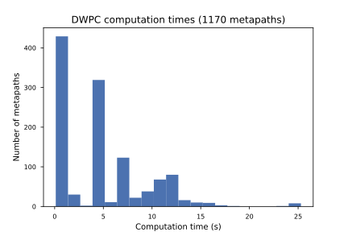
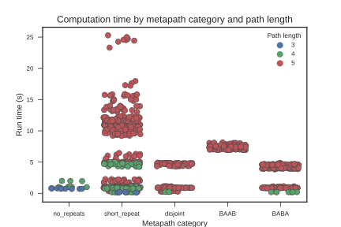

## Results

The main problem towards which I worked this summer was an implementation of the degree-weighted path count.
While the degree-weighted walk count is relatively trivial to implement with matrix multiplication, the path count is non-trivial.
If computational efficiency is to be considered, each category of metapath will require a different path-count method.
As of mid-August 2017, I have merged 7 pull requests into the main Hetmech repository on GitHub, and I have one open development branch.
These contributions amounted to 1043 lines added and 264 lines deleted in the repository.

### DWPC

I have completed an implementation of the degree-weighted path count (DWPC) in the form of several independent functions.
What follows are the specifics of this new method.

When a user calls the `dwpc` function over a metapath, a series of steps occur before any actual path-counting occurs.
First, the metapath is categorized according to its repeated metanodes.
For example, the metapath `GaDrDaG`, ('Gene-associates-Disease-resembles-Disease-associates-Gene') would be classified `BAAB`.
Further examples of this classification method are in Table @tbl:classification below.

Next, the metapath is split into segments according to its classification.
This step allowed for the abstraction of metapath patterns to metapaths which followed the pattern of a classification but included randomly inserted, non-repeating metanodes anywhere in the bath.
Splitting the metapath essentially allowed us to work with paths like `A-B-C-D-B-A` in the same way that we work with `A-B-B-A`, by abstracting any non-repeating metanodes to within segments.

| Metapath | Classification | Segments |
| -------- | -------------- | -------- |
| CbGiGbC | BAAB | CbG; GiG; GbC |
| DaGaDaG | BABA | DaG; GaD; DaG |
| DlAeGaDaG | BABA | DlAeG; GaD; DaG |
| CrCrC | short_repeat | CrCrC |
| DlAeG | no_repeats | DlAeG |
| CrCrCrC | long_repeat | CrCrCrC |
| CbGiGiGaDrDpCpD | interior_complete_group | CbG; GiGiG; GaD; DrD; DpC; CpD |

Table: Example metapaths with classifications and segments {#tbl:classification}

See Figure @fig:metapath_breakdown for a breakdown of all the metapaths according to their categorization.

{#fig:metapath_breakdown width="5in"}

Once the metapath is split into segments, the original metapath classification is used to select the appropriate DWPC function.
For example, if the metapath classification is `BAAB`, then the segmented metapath will be run in the function `dwpc_baab`.

Each DWPC function has a unique method for ensuring that it outputs a path-count rather than a walk count.
For many metapaths this was a non-trivial method to unravel, and often involved several steps of additions, subtractions, multiplications, and normalizations.
Our work was greatly aided by the help of the mathematician Dr. Kyle Kloster with whom we collaborated on some of the more challenging linear algebra algorithms.

In addition to the specific DWPC functions, I created a general method which works over all metapaths, no matter the length.
While slower than the other methods, this function allows us to ensure that every path is covered by the DWPC.
The method uses a dictionary of history vectors for every index in the matrix and splits computations whenever a path has the opportunity to diverge into multiple potential paths.

### Calculation time

Our new matrix method for calculating DWPC decreased the computation time by 97.8 percent.
We reduced the time to compute DWPC over nearly 1200 metepaths from roughly four-and-a-half days to roughly two hours [@url:https://github.com/dhimmel/learn/blob/master/all-features/3-extract.ipynb].
One of the major advances we made in our method this summer was the realization that we can calculate the DWPC more efficiently by categorizing each metapath and feeding it to a DWPC function corresponding to a particular metapath category.
These specialized functions allow us to increase significantly the speed with which we can make calculations.
However, while we were able to reduce almost all computation times, there are a number of metapaths which we cannot calculate significantly more quickly than we could with the old method.
36 of 1206 metapaths had to use the generalized function I wrote which enumerates each path independently using a dictionary of history vectors in order to ensure no nodes are repeated.

For the remaining 1170 metapaths, the corresponding DWPC calculation times are summarized in Figure @fig:all_metapath_times.

{#fig:all_metapath_times width="5in"}

As mentioned, we created a new system whereby metapaths are categorized according to the method we use for computing the DWPC.
For example, the metapath `CbGbCbGaD` is classified as `BABA`, due to the overlapping repeat nature of the metanodes for 'Compound' and 'Gene'.
See Figure @fig:metapath_breakdown for a breakdown of all the metapaths according to their categorization.

In trying to reduce runtime, we were constantly trying to optimize every step in our computation.
We were able to reduce runtimes significantly using sparse matrices as previously mentioned.
The key, however, to a faster computational pipeline was categorizing metapaths and using specialized functions for each metapath.
A breakdown of these functions' performance is in Figure @fig:category_runtimes.

{#fig:category_runtimes width="5in"}

Finally, in tracing back the slowest calculations, we found that a few metapaths took significantly longer than all others.
We discovered that these involved the metapaths with the segment `[...]GeAeG[...]` (see Figure  @fig:gene_times).

![Breakdown of the slowest metapath computation time by repeated Gene segment. 'G_X_G' is all metapaths which include a segment of three metanodes, whose innermost metanode is not 'Anatomy'. 'G_A_G' is all metapaths with a segment 'Gene'-'Anatomy'-'Gene' except those of the form 'GeAeG'. 'GeAeG' is strictly metapaths with the segment corresponding to 'Gene-expressed-Anatomy-expressed-Gene', meaning that there are two genes expressed in a certain anatomical region. Please note that there is no overlap between any of the three groups. 'GeAeG' is the most specific, and the other two groups do not include it. 'G_X_G' does includes neither any of the 'G_A_G' nor the 'GeAeG' metapaths.](images/gene_time_breakdown.svg){#fig:gene_times width="5in"}

### Multiple search capability

As with many graph traversal tasks, using adjacency matrices to calculated DWPC meant that querying a set of nodes has become simpler.
Our initial work has been on metapaths starting with compounds and ending with diseases.
Having cached our DWPC matrices along every C-[...]-D metapath with five or fewer edges, we can extract path counts for queried nodes by performing matrix-vector multiplication.

### Other summer results

I also gained a deeper appreciation of and respect for open-access and collaborative science.
In working towards this, I reported a relevant bug in the open source Python repository SciPy which dealt with issues involving matrix multiplication [@url:https://github.com/scipy/scipy/issues/7510].

In the deep learning review paper, I contributed a section on deep learning applications in the field of protein-protein interaction predictions, with a subsection on deep learning methods for the prediction of MHC-peptide binding [@url:https://github.com/greenelab/deep-review/pull/638].
